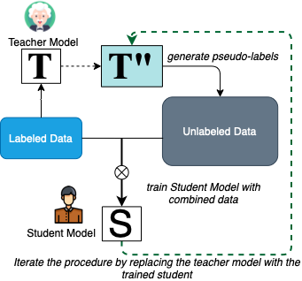

# Baseline: ASSET



This repository contains the **Pytorch** implementation of the model ASSET.

- The original paper: **[ASSET: A Sem-supervised Approach for Entity Typing in Knowledge Graphs.](https://dl.acm.org/doi/10.1145/3460210.3493563)**
- The original TensorFlow implementation: **[ASSET](https://github.com/dice-group/ASSET)**

## Summary

- ASSET uses 200-dimension ConnectE embeddings for FB15k and YAGO43k, and a 2-layer NN using a teacher-student pattern (semi-supervised) for entity typing classification.
- Here we reimplemented the ASSET model using **Pytorch**.
- Datasets are available through `data/` folder and please download the pre-trained **[ConnectE](https://drive.google.com/drive/folders/18tqK4US6rCK3VH2ChyTXBybaFc3CP96h?usp=sharing)** embeddings in advance to the corresponding data folder.
- Instead of using hamming loss $H_{loss}$ and $F_1$ score on selected top k classes predictions, we consider all classes in FB15kET and YAGO43kET datasets and use ranking-based metrics $MRR$ and $Hit@k$ to evaluate the model performance for inferring the missing entity types.
- Different from the original paper which considers only the top 10 types, here we include all types (3,584 for FB15kET and 45,182 for YAGO43kET), therefore we select a higher number of `labeled_size` as 0.5 to cover all trained types.
- The experiments have been tested on a Tesla V100S-PCIE-32GB GPU and you can evaluate ASSET's performance using the following commands:

**FB15kET:**

```markdown
python ASSET_pytorch.py --Dataset FB15kET --labeled_size 0.5 --patience 5
```

**YAGO43kET:**

```markdown
python ASSET_pytorch.py --Dataset YAGO43kET --labeled_size 0.5 --patience 1
```

**The default hyper-parameters in the experiments:**

```markdown
hidden_dim = 128       # the hidden dimension of teacher and student model
epochs = 100            # Maximum number of epochs
batch_size = 128        # How many sequences in each batch during training
lr = 0.001             # Learning rate of Adam optimizer
Dropout= 0.20          # Dropout rate in the Deep Neural Model
```
